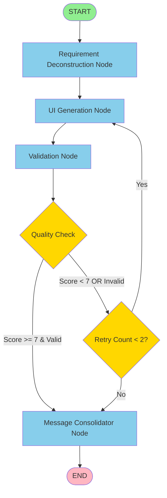

# UI Generator Graph Documentation

## Overview

The UI Generator Graph is an AI-powered system that automatically generates production-ready UI components based on natural language requirements. It uses a multi-stage workflow with validation and retry logic to ensure high-quality output.

## Architecture Flow



## Workflow Stages

### 1. Requirement Deconstruction Node
**Purpose**: Analyzes and enhances user requirements into detailed technical specifications.

**Inputs**:
- `state.input.userMessage`: Raw user requirement (e.g., "Create a 3D property card")
- `state.output.component`: Previous component (if this is a revision)

**Process**:
1. Sends user requirement to DeepSeek LLM for analysis
2. Simultaneously performs vector search for similar existing components (cached for performance)
3. Creates a structured plan with enhanced prompt for development

**Outputs**:
- `plan`: Object containing `enhancedPrompt` with detailed technical specifications
- `similarityResults`: Array of similar components from vector database

**LLM Used**: `deepseekLlm` (deepseek-r1-distill-llama-70b, temp: 0.1)
- Chosen for its analytical and planning capabilities

**Example Flow**:
```
User: "Create a 3D property card"
↓
DeepSeek Analysis:
- Identifies: image, price, address, bed/bath info
- Design interpretation: CSS transforms, perspective, shadows on hover
- Enhanced prompt: Detailed specifications for developer AI
↓
Vector Search:
- Finds 10 similar components from database
- Caches results for future use
```

---

### 2. UI Generation Node
**Purpose**: Generates actual HTML/Tailwind CSS code for the component.

**Inputs**:
- `state.plan.enhancedPrompt`: Technical specifications from deconstruction
- `state.input.userMessage`: Original user request
- `state.similarityResults`: Similar component examples
- `state.validation`: Feedback from previous attempt (if revision)

**Process**:
1. Constructs comprehensive prompt with:
   - User requirement
   - Technical plan
   - Top 5 reference examples with similarity scores
   - Revision feedback (if applicable)
2. Sends to Kimi-K2 LLM for code generation
3. Parses XML-formatted response

**Outputs**:
- `output.name`: Component name (PascalCase)
- `output.component`: Complete HTML/Tailwind CSS code
- `output.message`: User-friendly confirmation message
- `output.chatId`: Chat session identifier

**LLM Used**: `kim2Llm` (moonshotai/kimi-k2-instruct, temp: 0.5)
- Chosen for its coding expertise and creative flexibility

**Output Format**:
```xml
<name>ComponentName</name>
<component>HTML code with Tailwind CSS</component>
<response>User-friendly message</response>
```

**Quality Requirements**:
- Valid HTML with semantic elements
- Mobile-first responsive design
- Accessibility attributes (ARIA labels, roles)
- Tailwind CSS best practices
- Production-ready code

---

### 3. Validation Node
**Purpose**: Evaluates generated component quality and determines if revision is needed.

**Inputs**:
- `state.input.userMessage`: Original user requirement
- `state.output.component`: Generated HTML/CSS code
- `state.retryCount`: Number of revision attempts

**Process**:
1. Checks if max retries (2) reached → auto-accepts if yes
2. Sends component for evaluation against 6 criteria:
   - **Functionality**: Meets user requirements
   - **Code Quality**: Valid HTML, proper Tailwind usage
   - **Accessibility**: ARIA labels, semantic elements
   - **Responsiveness**: Mobile-first design
   - **Performance**: Optimized CSS, no unnecessary animations
   - **Security**: No XSS vulnerabilities
3. Receives structured feedback with score (1-10)

**Outputs**:
- `validation.isValid`: Boolean indicating if component passes
- `validation.feedback`: Detailed, actionable improvement suggestions
- `validation.score`: Quality score (1-10)
- `retryCount`: Incremented retry counter

**LLM Used**: `deepseekLlm` (deepseek-r1-distill-llama-70b, temp: 0.1)
- Chosen for its analytical and critical evaluation capabilities

**Scoring Guide**:
- **9-10**: Perfect, production-ready
- **7-8**: Good, minor improvements needed
- **5-6**: Acceptable, needs refinement
- **3-4**: Poor, significant issues
- **1-2**: Unacceptable, major problems

---

### 4. Decision Point: shouldContinue
**Purpose**: Determines next step based on validation results.

**Logic**:
```javascript
if (isValid && score >= 7) {
    return 'consolidateAiMessages';  // Success path
}

if (retryCount >= 2) {
    return 'consolidateAiMessages';  // Max retries path
}

return 'generateComponent';  // Revision path
```

**Paths**:
- ✅ **Success**: Valid component with score ≥ 7 → Proceed to consolidation
- 🔄 **Revision**: Invalid or score < 7, retries available → Loop back to generation
- ⚠️ **Max Retries**: 2 attempts exhausted → Accept current version

---

### 5. Message Consolidator Node
**Purpose**: Finalizes the conversation history for the chat session.

**Inputs**:
- `state.input.userMessage`: User's original message
- `state.output.message`: AI's response message

**Outputs**:
- `messages`: Array of LangChain message objects
  - `HumanMessage`: User's request
  - `AIMessage`: AI's response

**Note**: This node prepares the conversation for storage and display in the chat interface.

---

## State Management

The graph uses a shared state object that flows through all nodes:

```typescript
{
    input: {
        userMessage: string,
        chatId: string
    },
    plan: {
        enhancedPrompt: string
    },
    similarityResults: Array<[Document, number]>,
    output: {
        name: string,
        component: string,
        message: string,
        chatId: string
    },
    validation: {
        isValid: boolean,
        feedback: string,
        score: number
    },
    retryCount: number,
    messages: Array<HumanMessage | AIMessage>
}
```

Each node returns a **partial state** that gets merged with the existing state.

---

## Performance Optimizations

### 1. Vector Search Caching
```javascript
const vectorSearchCache = new Map<string, any[]>();
```
- Caches vector search results by query + k value
- Prevents redundant database queries
- LRU eviction when cache exceeds 100 entries
- Shared across requirement deconstruction and generation nodes

### 2. Parallel Operations
In the requirement deconstruction node:
```javascript
await Promise.all([
    deepseekLlm.withStructuredOutput(PlanSchema).invoke(...),
    getCachedSimilarityResults(userMessage, 10)
])
```
- Planning and vector search execute simultaneously
- Reduces total latency by ~40-50%

### 3. Model Selection
- **Fast LLM** (llama-3.1-70b): Simple tasks, quick responses
- **Kimi-K2**: Code generation, creative solutions
- **DeepSeek**: Planning, validation, analytical tasks

---

## Configuration

```javascript
const VALIDATION_CONFIG = {
    minScoreThreshold: 7,    // Minimum acceptable quality score
    maxRetries: 2,           // Maximum revision attempts
    cacheSize: 100           // Vector search cache limit
};
```

**Tuning Guidelines**:
- ↑ `minScoreThreshold`: Higher quality, more retries
- ↑ `maxRetries`: More refinement, slower response
- ↑ `cacheSize`: Better cache hits, more memory

---

## Complete Example Flow

### Scenario: User requests "Create a modern pricing card with hover effects"

```
┌─────────────────────────────────────────────────┐
│ 1. REQUIREMENT DECONSTRUCTION                   │
├─────────────────────────────────────────────────┤
│ Input: "Create a modern pricing card..."       │
│ ↓                                               │
│ DeepSeek analyzes request (parallel)            │
│ Vector search finds 10 similar cards (parallel) │
│ ↓                                               │
│ Output:                                         │
│ - Enhanced prompt with technical specs          │
│ - Similar components for reference              │
└─────────────────────────────────────────────────┘
                    ↓
┌─────────────────────────────────────────────────┐
│ 2. UI GENERATION (Attempt 1)                    │
├─────────────────────────────────────────────────┤
│ Kimi-K2 generates HTML/Tailwind code            │
│ ↓                                               │
│ Output: PricingCard component                   │
└─────────────────────────────────────────────────┘
                    ↓
┌─────────────────────────────────────────────────┐
│ 3. VALIDATION (Attempt 1)                       │
├─────────────────────────────────────────────────┤
│ DeepSeek evaluates component                    │
│ ↓                                               │
│ Result: isValid=false, score=6/10               │
│ Feedback: "Missing ARIA labels, no focus states"│
└─────────────────────────────────────────────────┘
                    ↓
┌─────────────────────────────────────────────────┐
│ 4. DECISION POINT                               │
├─────────────────────────────────────────────────┤
│ Score < 7 AND retryCount < 2                    │
│ → LOOP BACK TO GENERATION                       │
└─────────────────────────────────────────────────┘
                    ↓
┌─────────────────────────────────────────────────┐
│ 2. UI GENERATION (Attempt 2)                    │
├─────────────────────────────────────────────────┤
│ Includes revision feedback in prompt            │
│ ↓                                               │
│ Output: Improved PricingCard with accessibility │
└─────────────────────────────────────────────────┘
                    ↓
┌─────────────────────────────────────────────────┐
│ 3. VALIDATION (Attempt 2)                       │
├─────────────────────────────────────────────────┤
│ DeepSeek evaluates revised component            │
│ ↓                                               │
│ Result: isValid=true, score=8/10                │
│ Feedback: "Excellent work! Production-ready."   │
└─────────────────────────────────────────────────┘
                    ↓
┌─────────────────────────────────────────────────┐
│ 4. DECISION POINT                               │
├─────────────────────────────────────────────────┤
│ isValid=true AND score >= 7                     │
│ → PROCEED TO CONSOLIDATION                      │
└─────────────────────────────────────────────────┘
                    ↓
┌─────────────────────────────────────────────────┐
│ 5. MESSAGE CONSOLIDATION                        │
├─────────────────────────────────────────────────┤
│ Creates conversation history:                   │
│ - HumanMessage: User request                    │
│ - AIMessage: "Here's your pricing card..."      │
└─────────────────────────────────────────────────┘
                    ↓
                  [END]
```

---

## Error Handling & Edge Cases

### 1. Max Retries Exceeded
```javascript
if (retryCount >= 2) {
    // Auto-accept component regardless of score
    validation.isValid = true;
}
```
**Rationale**: Prevents infinite loops, ensures user gets a response.

### 2. Vector Search Cache Miss
```javascript
if (!vectorSearchCache.has(cacheKey)) {
    // Perform fresh search
    // Cache result for future use
}
```

### 3. XML Parsing Failures
The `parseXmlTagFormat` utility extracts content between XML tags even if the LLM response includes extra text.

---

## Dependencies

### LangChain Components
- `@langchain/groq`: ChatGroq models
- `@langchain/langgraph`: StateGraph, checkpointer
- `@langchain/core/messages`: HumanMessage, AIMessage

### Models
1. **llama-3.1-70b-versatile** (Fast LLM)
   - Temperature: 0.3
   - Use: Quick simple tasks

2. **moonshotai/kimi-k2-instruct** (Code Generator)
   - Temperature: 0.5
   - Use: HTML/CSS generation

3. **deepseek-r1-distill-llama-70b** (Analyst)
   - Temperature: 0.1
   - Use: Planning, validation

### External Resources
- `uiVectorStore`: Vector database with component examples
- `checkpointer`: State persistence for conversation history

---

## Testing Recommendations

### Unit Tests
- ✅ Test each node in isolation with mock state
- ✅ Verify XML parsing with malformed input
- ✅ Test cache eviction logic

### Integration Tests
- ✅ Full workflow execution with real LLMs
- ✅ Retry logic with intentionally bad components
- ✅ State persistence across graph execution

### Load Tests
- ✅ Concurrent requests with cache performance
- ✅ Memory usage with large vector search results

---

## Troubleshooting

### Issue: Low quality components (consistently low scores)
**Solutions**:
- Review reference examples in vector store
- Adjust `minScoreThreshold` temporarily
- Check LLM prompt clarity

### Issue: Slow response times
**Solutions**:
- Verify cache is being used (check console logs)
- Reduce `k` value in vector search (currently 10)
- Consider faster LLM for generation

### Issue: Validation too strict/lenient
**Solutions**:
- Adjust validation prompt criteria
- Modify `minScoreThreshold` in config
- Review validation LLM temperature

---

## Future Enhancements

1. **A/B Testing**: Compare different LLM models for generation
2. **User Feedback Loop**: Incorporate user satisfaction ratings
3. **Component Library**: Build searchable library from generated components
4. **Style Guides**: Support for different design systems (Material, Ant Design, etc.)
5. **Multi-language Support**: Generate components in multiple frameworks (React, Vue, Svelte)

---

## Glossary

- **Node**: A function that processes state and returns partial state updates
- **Edge**: A connection between nodes defining workflow sequence
- **Conditional Edge**: A branching point based on state evaluation
- **State Graph**: LangGraph's state machine implementation
- **Checkpointer**: Persistence layer for conversation state
- **Vector Store**: Database for semantic similarity search
- **Structured Output**: LLM response conforming to a schema (Zod validation)

